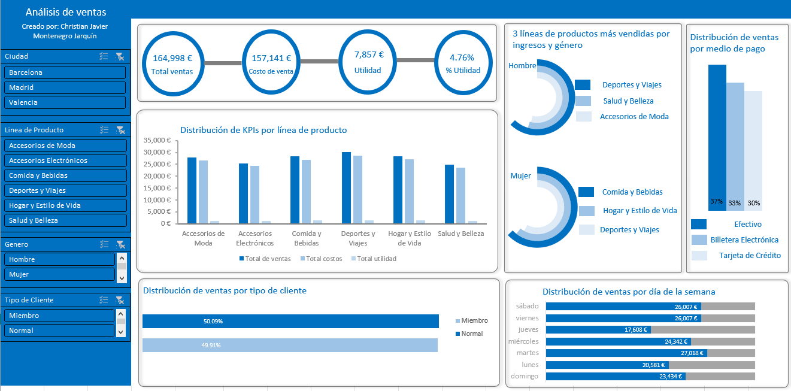
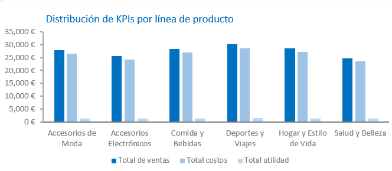
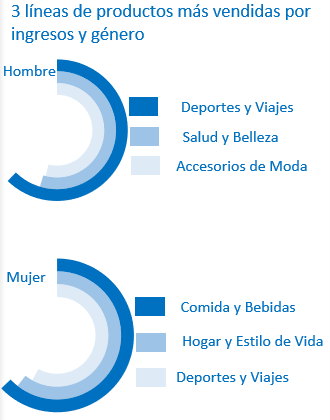
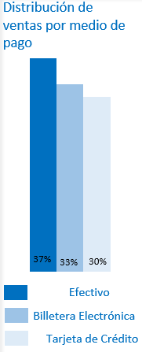
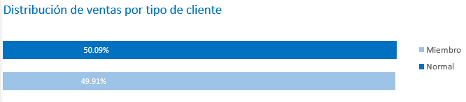
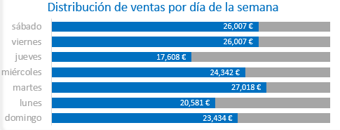

# Análisis de ventas para Costa Centro Comercio (CCC)

## Antecedentes y visión general

En el corazón de la península ibérica, donde la vibrante costa mediterránea se encuentra con la energía del centro, emerge Costa Centro Comercio (CCC), una compañía líder en la oferta de productos y servicios diversificados. Con una fuerte presencia en tres de los nodos urbanos más dinámicos de España - Barcelona, Madrid y Valencia - CCC se posiciona como el puente perfecto entre la innovación costera y la solidez del centro, brindando a sus clientes una experiencia de compra única y integral.

La compañía tiene cantidades masivas de información detallada e informativa de sus ventas. Este proyecto analiza detalladamente esa información para producir un reporte anual que determine áreas para mejorar.

Los descubrimientos y recomendaciones son proporcionadas en las siguientes áreas claves:

- Rendimiento general de ventas: ofrece métricas como el total de los ingresos, costo de venta, utilidad y % utilidad en el transcurso del año.

- Análisis por línea de producto: ofrece las métricas anteriores por línea de producto, por género y línea de producto.

- Análisis de patrones de los clientes: ofrece la distribución de ventas por tipo de cliente.

- Análisis de medios de pagos: ofrece la distribución de ventas por tipo de medio de pago.

Para poder facilitar la toma de decisiones de la compañía al entender mejor sus ventas, se creó un dashboard, que ofrece distintos gráficos y métricas claves relevantes para las partes interesadas.

## Estructura de datos y exploraciones iniciales
 
Se utilizó un conjunto de datos que contiene las transacciones de ventas de la compañía a lo largo del año 2019. Contiene los siguientes campos de información:

**Tabla de Campos y Propósitos**
| **Campo** | **Propósito** |
| --- | --- |
| **Fecha** | Registra la fecha en la que se realizó la transacción, permitiendo el análisis temporal de las ventas |
| **Sucursal** | Identifica la ubicación geográfica (Barcelona, Madrid o Valencia) donde se llevó a cabo la transacción, facilitando análisis regionales y de desempeño por sucursal |
| **Línea de producto** | Clasifica el producto vendido en una de las categorías predefinidas (Accesorios de moda, Accesorios electrónicos, Comidas y bebidas, Deportes y viajes, Hogar y estilo de vida, Salud y belleza), permitiendo el análisis de ventas por tipo de producto y la identificación de tendencias en diferentes sectores |
| **Medio de pago** | Registra el método utilizado por el cliente para realizar el pago (Efectivo, Tarjeta de Crédito, etc.), ayudando a entender las preferencias de pago de los clientes y a optimizar los métodos de pago disponibles |
| **Precio unitario** | Especifica el precio de venta de un solo artículo, necesario para calcular totals y analizar la rentabilidad por unidad |
| **Cantidad** | Indica la cantidad de unidades vendidas en una transacción, crucial para calcular el total de la venta y analizar volúmenes de ventas |
| **Total venta** | Muestra el monto total de la transacción, resultante de multiplicar el precio unitario por la cantidad vendida, utilizado para el cálculo de ingresos y análisis de ventas |
| **Costo de venta** | Registra el costo asociado a la producción o adquisición del producto vendido, esencial para calcular la utilidad y el margen bruto, y evaluar la rentabilidad de los productos |
| **Margen Bruto (%)** | Calcula el porcentaje de ganancia sobre el total de la venta, después de restar el costo de venta, proporcionando una medida rápida de la rentabilidad de cada transacción |
| **Utilidad** | Muestra la ganancia neta obtenida en una transacción, resultante de restar el costo de venta del total de la venta, utilizado para evaluar la rentabilidad y tomar decisiones de precios y de producción |

## Resumen ejecutivo

### Visión general de descubrimientos

El análisis de ventas de CCC para el año 2021 revela un panorama estable con areas de mejora. Se tuvieron ventas 
totales €164,998 y un beneficio de €7,857, la empresa mantuvo un margen de beneficio del 4.76%. En las siguientes 
secciones se explorará en detalle lo anteriormente mencionado.

El dashboard interactivo implementado en Excel,  puede ser encontrado  [aquí](https://1drv.ms/x/s!ApUe3nTukn-rawkMI6-e0Z-Xsdo?e=patDZ5).

### Análisis de las KPIs

En 2021, la empresa logró unas ventas totales de €164,998, con un costo de ventas de €157,141 y 
un beneficio resultante de €7,857.  Lo anterior se traduce en un margen de beneficio del 4.76%, siendo bajo, pero alentador.

### Análisis de líneas de productos

Las líneas de productos muestran una tendencia uniforme en las diferentes métricas de rendimiento 
usadas. Deporte y viajes encabezan la lista con ventas de €30,078 y una ganancia de €1,432. Los 
siguientes contendientes, Hogar/estilo de vida y salud/belleza, lograron ventas por valor de 
€28,487, y ganaron €1,357 en beneficio. Los sectores de alimentos y bebidas lograron ventas de 
€28,328 y un beneficio de €1,349. Los márgenes de beneficio  son estables con valores entre 4.7 a 4.8%.

### Análisis por género y producto

Los patrones de consumo a nivel de género revelan que los clientes masculinos, gastaron más en la 
línea de deportes y viajes con €15,568, mientras que salud/belleza y accessorios de moda, €13,669 
y €13,468 respectivamente. La línea de producto más vendida para clientes femeninos es alimentos 
y bebidas con €15,728 seguidas por hogar/estilo de vida con €15,142, la línea menos vendida es la 
de deportes y viajes con €14,510.

### Análisis de métodos de pago

La distribución del método de pago demuestra que un poco más de un tercio de los clientes prefiere usar 
efectivo (37%), seguido de billeteras electrónicas (33%) y tarjetas de crédito (%30).

### Análisis por tipo de cliente

La distribución de los clientes por su tipo de membresía revela que hay casi un equilibrio en la 
base de clientes. Los clientes regulares abarcan un 50.09% de la base de clientes, mientras 
que los clientes miembros un 49.91%.

### Análisis por día de la semana

El patrón de ventas semanales muestra picos notables los martes (€27,018), viernes y 
sábados (ambos con €26,007). El domingo mantiene un volumen respetable de €23,434, mientras 
que el jueves registra el volumen más bajo con €17,608. 

## Recomendaciones

Estas son las recomendaciones que propongo basado en los descubrimientos obtenidos mediante el análisis de ventas: 

- Optimización financiera: Impulsar el margen existente (4.76%) mediante el establecimiento de un sistema de compras 
por volumen en las líneas de producto con mejor rendimiento. 

- Segmentación y marketing: Orientar campañas basados en género al promover las líneas de producto más vendida como 
deportes/viajes para hombres y comida/hogar para mujeres. 

- Optimización operativa: Mantener un registro de los niveles de stock por categoría y reponer el stock según el 
pronóstico de ventas en días específicos. 